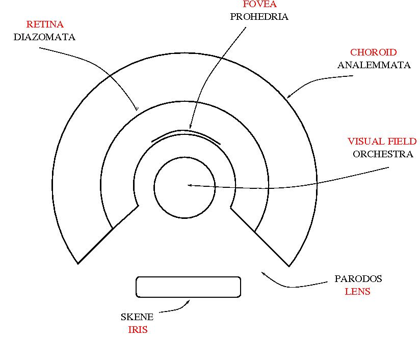
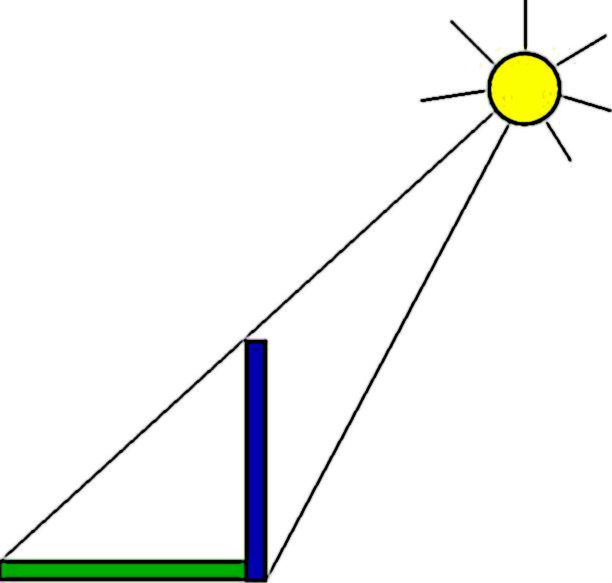
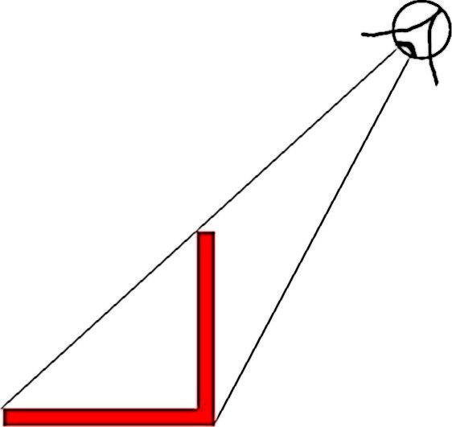

Gnomons and homunculi in the space theater 
===========================================

mbuliga\@pm.me or \@xorasimilarity on telegram

**also available:** 
<https://telegra.ph/Gnomons-and-homunculi-in-the-space-theater-05-24>

#### 1. The Cartesian Theater: philosophy of mind versus aerography {#1.-The-Cartesian-Theater:-philosophy-of-mind-versus-aerography}

**source:**
<https://chorasimilarity.wordpress.com/2011/06/06/the-cartesian-theater-philosophy-of-mind-versus-aerography/>

Looks to me there is something wrong with the Cartesian Theater term.

Short presentation of the Cartesian Theater, according to wikipedia:

>    The Cartesian theater is a derisive term coined by philosopher
> Daniel Dennett to pointedly refer to a defining aspect of what he
> calls Cartesian materialism, which he considers to be the often
> unacknowledged remnants of Cartesian dualism in modern materialistic
> theories of the mind.

>    Descartes originally claimed that consciousness requires an
> immaterial soul, which interacts with the body via the pineal gland of
> the brain. Dennett says that, when the dualism is removed, what
> remains of Descartes' original model amounts to imagining a tiny
> theater in the brain where a homunculus (small person), now physical,
> performs the task of observing all the sensory data projected on a
> screen at a particular instant, making the decisions and sending out
> commands.

Needless to say, any theory of mind which can be reduced to the
Cartesian Theater is wrong because it leads to the homunculus fallacy:
the homunculus has a smaller homunculus inside which is observing the
sensory data, which has a smaller homunculus inside which ...

This homunculus problem is very important in vision. More about this in
a later post.

According to Dennett, the problem with the Cartesian theater point of
view is that it introduces an artificial boundary (from Consciousness
Explained (1991), p. 107)

>    ...there is a crucial finish line or boundary somewhere in the
> brain, marking a place where the order of arrival equals the order of
> "presentation" in experience because what happens there is what you
> are conscious of.

As far as I understand, this boundary creates a duality: on one side is
the homunculus, on the other side is the stage where the sensory data
are presented. In particular this boundary acts as a distinction, like
in the calculus of indications of Spencer-Brown' Laws of Form.

This distinction creates the homunculus, hence the homunculus fallacy.
Neat!

Why I think there is something wrong with this line of thought? Because
of the "theater" term. Let me explain.

The following is based on the article of Kenneth R Olwig

"All that is landscape is melted into air: the \`aerography' of ethereal
space", Environment and Planning D: Society and Space 2011, volume 29,
pages 519 -- 532.

but keep in mind that what is written further represents my
interpretation of some parts of the article, according to my
understanding, and not the author point of view.

There has been a revolution in theater, started by

>    "...the early-17th-century court masques (a predecessor of opera)
> produced by the author Ben Jonson (the leading author of the day after
> Shakespeare) together with the pioneering scenographer and architect
> Inigo Jones.

>    The first of these masques, the 1605 Masque of Blackness
> (henceforth Blackness ), has a preface by Jonson containing an early
> use of landscape to mean scenery and a very early identification of
> landscape with nature (Olwig, 2002, page 80), and Jones's scenography
> is thought to represent the first theatrical use of linear perspective
> in Britain (Kernodle, 1944, page 212; Orgel, 1975)." (p. 521)Ben
> Johnson,

So? Look!

>    "From the time of the ancient Greeks, theater had largely taken
> place outside in plazas and market places, where people could circle
> around, or, as with the ancient Greco-Roman theater or Shakespeare's
> Globe, in an open roofed arena. Jones's masques, by contrast, were
> largely performed inside a fully enclosed rectangular space, giving
> him control over both the linear-focused geometrical perspectival
> organization of the performance space and the aerial perspective
> engendered by the lighting (Gurr, 1992; Orrell, 1985)." (p. 522, my
> emphasis)

> 

>    "Jonson's landscape image is both enframed by, and expressive of,
> the force of the lines of perspective that shoot forth from "the eye"
> -- notably the eye of the head of state who was positioned centrally
> for the best perspectival gaze." (p. 523, my emphasis)

> 

>    "Whereas theater from the time of the ancient Greeks to
> Shakespeare's Globe was performed in settings where the actor's shadow
> could be cast by the light of the sun, Jones's theater created an
> interiorized landscape in which the use of light and the structuring
> of space created an illusion of three dimensional space that shot from
> the black hole of the individual's pupil penetrating through to a
> point ending ultimately in ethereal cosmic infinity. It was this space
> that, as has been seen, and to use Eddington's words, has the effect
> of "something like a turning inside out of our familiar picture of the
> world" (Eddington, 1935, page 40). It was this form of theater that
> went on to become the traditional \`theater in a box' viewed as a
> separate imagined world through a proscenium arch." (p. 526, my
> emphasis)

I am coming to the last part of my argument: Dennett' Cartesian Theater
is a "theater in a box". In this type of theater there is a boundary,

>    "... scenic space separated by a limen (or threshold) from the
> space of the spectators -- today's \`traditional' performance space
> \[on liminality see Turner (1974)\]" (p. 522)

a distinction, as in Dennett argument. We may also identify the
homunculus side of the distinction with the head of state.

But this is not all.

Compared with the ancient Greeks theater, the "theater in a box" takes
into account the role of the spectator as the one which perceives what
is played on stage.

Secondly, the scenic space is not "what happens there", as Dennett
writes, but a construction already, a controlled space, a map of the
territory and not the territory itself.

**Conclusion:** in my view (contradict me please!) the existence of the
distinction (limen) in the "Cartesian theater", which creates the
homunculus problem, is superficial. More important is the fact that
"Cartesian theater", as "theater in a box", is already a representation
of perception, having on one side of the limen a homunculus and on the
other side a scenic space which is not the "real space" (as for example
the collection of electric sparks sent by the sensory organs to the
brain) but instead is as artificial as the homunculus, being a space
created and controlled by the scenographer.

Litmus test: repeat the reasoning of Dennett after replacing the
"theater in a box" preconception of the "theater" by the older theater
from the time of ancient Greeks. Can you do it?

#### 2. Towards aerography, or how space is shaped to comply with the perceptions of the homunculus {#2.-Towards-aerography,-or-how-space-is-shaped-to-comply-with-the-perceptions-of-the-homunculus}

**source:**
<https://chorasimilarity.wordpress.com/2011/08/04/towards-aerography-or-how-space-is-shaped-to-comply-with-the-perceptions-of-the-homunculus/>

In the previous post I explained why the Cartesian Theater is not well
describing the appearance of the homunculus.

A "Cartesian theater", Dennett proposes, is any theory about what
happens in one's mind which can be reduced to the model of a "tiny
theater in the brain where a homunculus ... performs the task of
observing all the sensory data projected on a screen at a particular
instant, making the decisions and sending out commands."

This leads to infinite regression, therefore any such theory is flawed.
One has to avoid the appearance of the homunculus in one's theory, as a
consequence.

The homunculus itself may appear from apparently innocuous assumptions,
such as the introduction of any limen (or threshold), like supposing
that (from Consciousness Explained (1991), p. 107)

>    "...there is a crucial finish line or boundary somewhere in the
> brain, marking a place where the order of arrival equals the order of
> "presentation" in experience because what happens there is what you
> are conscious of."

By consequence such assumptions are flawed. There is no limen, boundary
inside the brain (strangely, any assumption which supposes a boundary
which separates the individual from the environment is not disturbing
anybody excepting Varela, Maturana, or the second order cybernetics).

In the previous post I argued, based on my understanding of the
excellent paper of Kenneth R Olwig

"All that is landscape is melted into air: the \`aerography' of ethereal
space", Environment and Planning D: Society and Space 2011, volume 29,
pages 519 -- 532,

that the "Cartesian theater" model is misleading because it neglects to
notice that what happens on stage is as artificial as the homunculus
spectator, while, in the same time, the theater itself (a theater in a
box) is designed for perception.

Therefore, while everybody (?) accepts that there is no homunculus in
the brain, in the same time nobody seems to be bothered that always the
perception data are modeled as if they come from the stage of the
Cartesian theater.

For example, few would disagree that we see a 3-dimensional, euclidean
world. But this is obviously not what we see and the proof is that we
can be easily tricked by stereoscopy. These are the visual data
(together with other, more subtle, auditory, posture and whatnot) which
the brain uses to reconstruct the world as seen by a homunculus, created
by our illusory image that there is a boundary between us (me, you) and
the environment.

You would say: nobody in the right mind denies that the world is 3d, at
least our familiar everyday world, not quantum or black holes or other
inventions of physicists. I don't deny it, just notice, like in this
previous post, that the space is perceived as it is based on prior
knowledge, that is because prior "controlled hallucinations" led
consistently to coherent interpretations.

The idea is that in fact there are two things to avoid: one is the
homunculus and the other one is the scenic space.

The "scenic space" is itself a model of the real space (does this
exists?) and it leads itself to infinite regression. We "learn space" by
relating to it and modeling it in our brains. I suppose that all (inside
and outside of the brain) complies with the same physical laws and that
the rational explanation for the success of the "3d scenic space" (which
is consistent with our educated perception, but also with physical
phenomena in our world, at least at human scale and range) should come
from this understanding that brain processes are as physical as a
falling apple and as mathematical as perspective is.

#### 3. Theatron as an eye {#3.-Theatron-as-an-eye}

**source:**
<https://chorasimilarity.wordpress.com/2012/01/07/theatron-as-an-eye/>

I want to understand what "computing with space" might be. By making a
parallel with the usual computation, there are three ingredients which
need to be identified: what are the computing with space equivalents of

1\. the universal computing gate (in usual computing this is the
transistor)

2\. the universal machine (in usual computing this is the Turing machine)

3\. what is the universal machine doing by using its arrangement of
universal computing gates (in usual computing this is the algorithm).

I think that (3) is (an abstraction of) the activity of map making, or
space exploration. The result of this activity is coded by a dilation
structure, but I have no idea HOW such a result is achieved. Once
obtained though, a mathematical model of the space is the consequence
of a priori assumptions (that we can repeat in principle indefinitely
the map making operations) which lead to the emergent algebraic and
differential structure of the space.

The universal gate (1), I think, is the dilation gate, or the
map-territory relation.

Today I want to pave the way to the discovery of the universal machine
(2). This is related to my previous posts The Cartesian Theater:
philosophy of mind versus aerography and Towards aerography, or how
space is shaped to comply with the perceptions of the homunculus.

My take is that the Greek Theater, or Theatron (as opposed to the
"theater in a box", or Cartesian Theater) is a good model for an
universal machine.

For today, I just want to point to the similarities between the theatron
and the eye.

The following picture represents the main parts of the theatron (the
ancient greek meaning of "theatron" is "place of seeing). In black are
written the names of the theatron parts and in red you see the names of
the corresponding parts of the eye, according to the proposed
similarity.

<https://chorasimilarity.files.wordpress.com/2012/01/theatron_eye1.jpg>

Let me proceed with the meaning of these words:

-- Analemmata means the pedestal of a sundial (related with analemma and
analemmatic sundial; basically a theatron is an analemmatic sundial,
with the chorus as the gnomon). I suggest to parallel this with the
choroid of the eye.

-- Diazomata (diazoma means "belt"), proposed to be similar with the
retina.

-- Prohedria (front seating) is a privilege to sit in the first few rows
at the bottom of the viewing area. Similar with the fovea (small pit),
responsible for sharp central vision.

-- Skene (tent), the stage building, meant to HIDE the workings of the
actors which are not part of the show, as well as the masks and other
materials. When a character dies, it happens behind the skene.
Eventually, the skene killed the chorus and became the stage. The eye
equivalent of this is the iris.

-- Parodos (para -- besides, counter, and ode -- song) entrance of the
chorus. Eye equivalent is the crystalline lens.

-- Orchestra, the ancient greek stage, is the place where the chorus
acts, the center of the greek theater. Here we pass to abstraction: the
eye correspondent is the visual field.

#### 4. The gnomon in the greek theater of vision, I {#4.-The-gnomon-in-the-greek-theater-of-vision,-I}

**source:**
<https://chorasimilarity.wordpress.com/2012/04/18/the-gnomon-in-the-greek-theater-of-vision-i/>

In the post Theatron as an eye I proposed the Greek Theater, or Theatron
(as opposed to the "theater in a box", or Cartesian Theater, see
further) as a good model for  vision.

Any model of vision should avoid the homunculus fallacy. What looks less
understood is that any good model of vision should avoid the scenic
space fallacy. The Cartesian Theater argument against the existence of
the homunculus is not, by construction, an argument against the scenic
space. Or, in the Cartesian Theater, homunculus and scenic space come to
existence in a pair. As a conclusion, it seems that there could not be a
model of vision which avoids the homunculus but is not avoiding the
scenic space. This observation is confirmed by facts: there is no good,
rigorous model of vision up to date, because all proposed models rely on
the a priori existence of a scenic space. There is, on the contrary, a
great quantity of experimental data and theoretical partial models which
show just how complex the problem of vision is. But, essentially, from a
mathematician viewpoint, it is not known how to even formulate the
problem of vision.

In the influent paper "[The brain a geometry
engine](http://www.ncbi.nlm.nih.gov/pubmed/2281124)" J. Koenderink
proposes that (at least a part of) the visual mechanism is doing a kind
of massively parallel computation, by using an embodiment of the
geometry of jet spaces (the euclidean infinitesimal geometry of a smooth
manifold) of the scenic space. Jean Petitot continues along this idea,
by proposing a neurogeometry of vision based essentially on the
sub-riemannian geometry of those jet spaces. This an active mathematical
area of research, see for example "Antropomorphic image reconstruction
via hypoelliptic diffusion", by Ugo Boscain et al.

Sub-riemannian geometry is one of my favorite mathematical subjects,
because it is just a particular model of a metric space with
dilations. Such spaces are somehow fundamental for the problem of
vision, I think. Why? because there is behind them a purely relational
formalism, called "emergent algebra", which allow to understand
"understanding space" in a purely relational way. Thus I hope emergent
algebras could be used in order to formulate the problem of vision as
the problem of computing with space, which in turn could be used for
getting a good model of vision.

To my surprise, some time ago I have found that this very complex
subject has a respectable age, starting with Pythagora and Plato! This
is how I arrived to write this blog, as an effort to disseminate what I
progressively understand.

This brings me back to the theater and, finally, to
[gnomon](http://en.wikipedia.org/wiki/Gnomon). I cite from previous wiki
link:

>    Hero defined a gnomon as that which, added to an entity (number or
> shape), makes a new entity similar to the starting entity.

In the greek theater, a gnomon sits in the center of the orchestra
(which is the circular place where things happen in the greek thater,
later replaced by the scene in the theater in a box). Why?

#### 5. Right angles everywhere (I) {#5.-Right-angles-everywhere-(I)}

**source:**
<https://chorasimilarity.wordpress.com/2012/10/16/right-angles-everywhere-i/>

Look at almost any building in the contemporary city, it's constructed
from right angles, assembled into rectangles, assembled into boxes. We
expect, in fact, a room to have a rectangular floor, with vertical walls
meeting in right angles. Exceptions are either due to architectural
fancies or to historical constraints or mistakes.

When a kid draws a house, it looks like a rectangle, with the triangle
of the roof on top.

Is this normal? Where does this obsession of the right angle comes from?

The answer is that behind any right angle is hidden a gnomon. We build
like this because we are Pythagoras children, living by the rules and
categories of our cultural ancestors, the ancient greeks.

Let's see:

\(I) In ancient times, or in places far from the greeks (and
babylonians), other architectural forms are preferred, like
the roundhouse. Here's a Scottish broch (image taken from this wiki
page)

<https://chorasimilarity.files.wordpress.com/2012/10/broch.jpg>

and here's a Buddhist [stupa](http://en.wikipedia.org/wiki/Stupa) (image
taken from the wiki page)

<https://chorasimilarity.files.wordpress.com/2012/10/sarnath1.jpg>

Another ancient building form is the [step
pyramid](http://en.wikipedia.org/wiki/Step_pyramid) , like the Great
Ziggurat of Ur (image taken from the last wiki page)

<https://chorasimilarity.files.wordpress.com/2012/10/800px-ancient_ziggurat_at_ali_air_base_iraq_2005.jpg>

or the egyptian pyramids, or any other famous pyramid in the world
(there are plenty of them, in very different cultural frames).

Here is a [Sardinian Nuraghe](http://en.wikipedia.org/wiki/Nuraghe)

<https://chorasimilarity.files.wordpress.com/2012/10/nuraghe_losa.jpg>

**Conclusion: round, conical, pyramidal is the rule, there are no right
angles there!**

Until the greeks: here's the
[Parthenon](http://en.wikipedia.org/wiki/Parthenon)

<https://chorasimilarity.files.wordpress.com/2012/10/800px-the_parthenon_in_athens.jpg>

**It is made of gnomons.**

#### 6. Right angles everywhere (II), about the gnomon {#6.-Right-angles-everywhere-(II),-about-the-gnomon}

**source:**
<https://chorasimilarity.wordpress.com/2012/10/19/right-angles-everywhere-ii-about-the-gnomon/>

In this post I shall write about the gnomon. According to
[wikipedia](https://en.wikipedia.org/wiki/Gnomon),

>    The gnomon is the part of a sundial that casts the shadow. Gnomon
> (γνώμων) is an ancient Greek word meaning "indicator", "one who
> discerns," or "that which reveals."

In the next figure are collected the minimal ingredients needed for
understanding the gnomon: the sun, a vertical shape and its horizontal
shadow.

<https://chorasimilarity.files.wordpress.com/2012/10/gnomon_1.jpg>

That is the minimal model of the ancient greek visual universe: sun, a
man and its shadow on the beach. It is a speculation, but to me, a
gnomon seems to be a visual atom.

Pythagoreans extracted from this minimal visual universe the pattern and
used it for giving an explanation for the human vision, described by the
next figure.

<https://chorasimilarity.files.wordpress.com/2012/10/gnomon_2.jpg>

Here the sun is replaced by the eye (of a god, initially, but the
pattern might apply to a mortal also), the light rays emanated by the
sun are assimilated with the lines of vision (from here the
misconception that the ancient greeks really believed that the eyes
shoot rays which illuminate the field of vision) and the indivisible
pair man-shadow becomes the L-shape of a gnomon. An atom of vision.

Here comes a second level of understanding the gnomon, also of
pythagoreic flavor. I cite again from the wiki page:

>    Hero defined a gnomon as that which, added to an entity (number or
> shape), makes a new entity similar to the starting entity.

This justifies the Euclid' picture of the gnomon, as a generator of
self-similarity:

<https://chorasimilarity.files.wordpress.com/2012/10/500px-gnomon-svg1.png>

(image taken from the wiki page on gnomon)

So maybe the word "atom" is less appropriate than "generator". In
conclusion, according to ancient greeks, a gnomon (be it a triple
sun-man-shadow or a pair eye -- elementary L-shape) is the generator of
the visual perception, via the mechanism of self-similarity.

In their architecture, they tried to make this obvious,
readable. **Because it's scalable (due to the relation with
self-similarity), the architectural solution of constructing with
gnomons invaded the world.**

#### 7. Another discussion about computing with space {#7.-Another-discussion-about-computing-with-space}

**source:**
<https://chorasimilarity.wordpress.com/2013/07/18/another-discussion-about-computing-with-space/>

Computing with space vs space computing.

Space (real space, we all share) is not made of points. A point is an
abstraction, the unattainable goal of a thought experiment, an atom of
thought. Or a string of numbers (when we think with coordinates).
Quantum physics tells us we can't perform, even in principle, a physical
experiment with the goal of exactly localizing the position of an object
in space.

That's pop philosophy. It might even be wrong (for example what quantum
physics tells us is that we can't perform physical experiments for
localizing a particle in the phase space (position, momentum), not in
the real space, whatever that means.

That's also the turf of theoretical physicists, there are several, with
various degree of mathematical soundness, theories about the structure
of space. I shall not go in this direction, further.

Instead, I want to make a case for a biology inspired point of view. I
made it before, repeatedly, starting with More than discrete or
continuous: a bird's view, but now I have a bit more tools to tackle it,
and a bit of more patience to not hurry to conclusions.

So, if you prefer the red pill, then read this. Can you think about
space in terms of what it does, not what it is? Can you describe space
as seen by a fly, or by a toddler, or you need to stick to cartesian
conventions and then fall into the trap of continuous vs discrete, and
so on?

Think like this: you are a fly and you have 10\^5 neurons and 10\^7
synapses. You are very good at flying by using about 10-20 actuators,
and you see really well because the most part of your brain is busy with
that. Now, where in that brain and how exactly there is place for
a representation of an euclidean 3d space? Mind you that humans have
very little idea about how flies brains are capable of doing this and
also, with their huge brains and their fast computers (much more faster
and much bigger than a fly's brain) were not successful yet to make a
robot with the same competences as a fly. (They will make one, there is
no magic involved, but the constraints are really hard: an autonomous
fly which can survive with the energy consumption comparable with the
one of a real fly, without computing or human exterior help, in a
natural environment, for 24hrs, find food, avoid traps and eventually
mate.)

So, after this motivating example, I state my hypothesis: whatever space
is (and that's a very hard and old problem), let's not think about it
passively (like a robot fly which is driven by some algorithms which use
advanced human knowledge about euclidean geometry, systems of
coordinates and the laws of mechanics) as being a receptacle, a
something. Let's think about space as described by what you can do in
it.

The fly, for example, cannot possibly have a passive representation of
space (and for us is the same) in the brain, but it does have the
possibility to manipulate it's actuators as a function of what it sees
(i.e. of what it's receptors perceive and send further to the brain) and
of the state of it's brain (and maybe on the history of that state, i.e.
memory, stored in a mysterious way in the same tiny brain). However,
actuators, sensors, brain and the environment are just one system, there
is no ghost in, or outside that fly machine.

My hypothesis is that for the fly, that's space. For us is the same, but
we are far more complex than the fly. However, deep in our brains there
are "patterns" (are they assemblies of neurons, are they patterns of
synaptic activity, is it chemical, electric, ...?) which are very basic
(a child learns to see in the first months) and which are space, for us.

Now I'll get mathematical. There are spaces everywhere in math, for
example when we say: that's a vector space, that's a manifold, or even
this is a group, a category, and so on. We say like this, but what we
actually have (in the mind) is not a manifold, or a vector space, a
group or category, but some short collections of patterns (rules, moves,
axioms) which can be applied to the said objects. And that is enough for
doing mathematics. This can be formalized, for example it's enough to
have some simple rules involving gates with two inputs and an output
(the dilations) and we can prove that these simple rules describe all
the concepts associated to any vector space, for example. and moreover
not using at any moment any external knowledge. A dilation is simply the
pattern of activities related to map making.

So, according to my hypothesis, a generic vector space is this
collection of rules. When it comes to the dimension of it, there are
supplementary relations to be added for being able to say that we speak
about a 3d vector space, but it will be always about a generic 3d vector
space. There is no concrete 3d space, when we say, for example, that we
live in a 3d space, what we really say is that some of the things we can
do in a generic 3d space can also be done in reality (i.e. we can
perform experiments showing this, although there are again studies
showing that our brain is almost as bad as concerns perceiving relations
in the real space which correspond to theorems in geometry, as it is
when we force it to do logic reasonings).

Conclusion for this part: there may be or not a passive space, the
important thing is that when we think with space and about space, what
we really do is using a collection of primitive patterns of thought
about it.

Now, going to the Turing machine, it lacks space. Space can be used for
enumeration, for example, but the Turing machine avoids this by
supposing there is a tape (ordered set). It is proved that enumeration
(i.e. the thing which resembles the most with space in the world of
Turing machines) does not matter in the sense that it can be arbitrarily
changed and still the conclusions and definitions from the field do not
change. This is alike saying that the Turing machine is a geometrical
object. But there is no geometrical description of a Turing machine (as
far as I know) which is not using enumeration. This is alike saying that
CS people can understand the concept of a sphere in terms of atlases ,
parametrizations and changes between those, but they can't define
spheres without them. Geometers can, and for this reason they can speak
about what is intrinsically geometric about the sphere and what is only
an artifact of the chosen coordinate system. In this sense, geometers
are like flies: they know what can be done on a sphere without needing
to know anything about coordinate systems.

#### 8. On the exterior homunculus fallacy {#8.-On-the-exterior-homunculus-fallacy}

**source:**
<https://chorasimilarity.wordpress.com/2013/07/20/on-the-exterior-homunculus-fallacy/>

If we think about a homunculus outside the brain, the homunculus fallacy
still functions.

According to
[wikipedia](https://en.wikipedia.org/wiki/Homunculus_argument):

>    The homunculus argument is a fallacy arising most commonly in the
> theory of vision. One may explain (human) vision by noting that light
> from the outside world forms an image on the retinas in the eyes and
> something (or someone) in the brain looks at these images as if they
> are images on a movie screen (this theory of vision is sometimes
> termed the theory of the Cartesian Theater: it is most associated,
> nowadays, with the psychologist David Marr). The question arises as to
> the nature of this internal viewer. The assumption here is that there
> is a 'little man' or 'homunculus' inside the brain 'looking at' the
> movie.

>    The reason why this is a fallacy may be understood by asking how
> the homunculus 'sees' the internal movie. The obvious answer is that
> there is another homunculus inside the first homunculus's 'head' or
> 'brain' looking at this 'movie'. But how does this homunculus see the
> 'outside world'? In order to answer this, we are forced to posit
> another homunculus inside this other homunculus's head and so forth.
> In other words, we are in a situation of infinite regress. The problem
> with the homunculus argument is that it tries to account for a
> phenomenon in terms of the very phenomenon that it is supposed to
> explain.

**Suppose instead that the homunculus is outside the brain.** Why, for
example think about the experimenter doing research on your vision. The
fallacy functions as well, because now we have another homunculus
(outside the brain) who looks at the movie screen (i.e. the measurements
he performed on your visual system, in the medium controlled by him).
"But how does this homunculus see the 'outside world'?" Infinite
regression again.

If you think that is outrageous, then let me give you an example. The
exterior homunculus (experimenter) explains your vision by interpreting
the controlled space he put you in (the lab) and the measurements he
performed. When he does this interpretation he relies on:

   physical laws

   geometrical assumptions

   statistical assumptions

at least. Suppose that the experimenter says: "to the subject \[i.e.
you\] was presented a red apple, at distance d, at coordinates x,y,z. By
the physical laws of opticks and by the geometrical setting of the
controlled lab we know that the sensor S of the retina of the left eye
was stimulated by the light coming from the apple. We recorded a pattern
of activity in the regions A, B, C of the brain, which we know from
other knowledge (and statistical assumptions) that  A is busy with
recognition of fruits, B is involved in contour recognition and C with
memories from childhood." I agree that is a completely bogus
simplification of what the real eperimenter will say, but bear with me
when I claim that the knowledge used by the experimenter for explaining
how you see the apple has not much to do with the way you see and
recognize the apple. In the course of the explanation, the experimenter
used knowledge about the laws of optics, used measurements which are
outside you, like coordinates and geometric settings in the lab, and
even notions from the experimenter's head, as "red", "apple" and
"contours".

Should the experimenter not rely on physical laws? Or on geometrical
asumptions (like the lab is in a piece of euclidean 3d space)? Of course
he can rely on those. Because, in the case of physical laws, we
recognize them as physical because they are invariant (i.e. change in a
predictable way) on the observer. Because in the case of geometrical
assumptions we recognize them as geometrical because they are invariant
on the parametrization (which in the lab appears as the privilege of the
observer).

But, as it is the case that optics can explain only what happens with
the light until it hits the retina, not more, the assumptions in the
head of the experimenter, even physical and geometrical, cannot be used
as an explanation for the way you see. Because, simply put, it is much
more likely that you don't have a lab in the head which is in a
euclidean space, with an apple, a lamp and rules for measuring distances
and angles.

You may say that everybody \[added: [except
Wittgenstein](https://chorasimilarity.wordpress.com/2021/05/23/a-wittgenstein-joke/)\]
knows that apples are not red \[i.e. they don\'t have intrinsic
colour\], that's a cheap shot because apples scatter light of all
frequencies and it just happen that our sensors from the retina are more
sensible at some frequencies than other. Obvious. However, it seems that
not many recognize that contours are as immaterial as colors, they are
in the mind, not in reality, as Koenderink writes in [Theory of
"Edge-Detection" JJ Koenderink -- Analysis for Science, Engineering and
Beyond,
2012](https://link.springer.com/chapter/10.1007/978-3-642-20236-0_3).

The explanation of vision which uses an exterior homunculus becomes
infinite regression unless we also explain how the exterior homunculus
thinks about all these exterior facts as lab coordinates, rational
deductions from laws of physics and so on. It is outrageous, but there
is no other way.

Let's forget about experiments on you and let's think about experiments
on fly vision. Any explanation of fly vision which uses knowledge which
is not, somehow, embodied in the fly brain, falls into the
(exterior) homunculus fallacy.

So what can be done, instead? Should we rely on magic, or say that no
explanation is possible, because any explanation will be issued by an
exterior homunculus? Of course not. When studying vision, nobody in the
right mind doubts about the laws of optics. They are science (i.e.
reproducible and falsifiable). But they don't explain all the vision,
only the first, physical step. Likewise, we should strive for giving
explanations of vision which are scientific, but which do not make
appeal to a ghost, in the machine or outside the machine.

Up to now, I think that is the best justification for the efforts of
understanding space not in a passive way.

#### 9. Ideology in the vision theater {#9.-Ideology-in-the-vision-theater}

**source:**
<https://chorasimilarity.wordpress.com/2013/07/25/ideology-in-the-vision-theater/>

Thanks to Kenneth Olwig for suggesting that ideology may be related to
the argument from the post On the exterior homunculus fallacy . More
precisely, Olwig points to the following quote from The German Ideology
by Karl Marx and Friedrich Engels:

>    If in all ideology men and their circumstances appear upside-down
> as in a camera obscura, this phenomenon arises just as much from their
> historical life-process as the inversion of objects on the retina does
> from their physical life-process. In direct contrast to German
> philosophy which descends from heaven to earth, here we ascend from
> earth to heaven. That is to say, we do not set out from what men say,
> imagine, conceive, nor from men as narrated, thought of, imagined,
> conceived, in order to arrive at men in the flesh. We set out from
> real, active men, and on the basis of their real life-process we
> demonstrate the development of the ideological reflexes and echoes of
> this life-process. The phantoms formed in the human brain are also,
> necessarily, sublimates of their material life-process, which is
> empirically verifiable and bound to material premises.

In The Cartesian Theater: philosophy of mind versus aerography, I use
the article "All that is landscape is melted into air: the \`aerography'
of ethereal space", Environment and Planning D: Society and Space 2011,
volume 29, pages 519 -- 532 by Olwig in order to argue that the
Cartesian Theater notion of Dennett is showing only one half of the
whole homunculus fallacy. Indeed, Dennett's theater is a theater in a
box, the invention of Inigo Jones, already designed around the king (or
homunculus, in Dennett argument), using geometrical perspective for
giving an appearance of reality to an artificial construct, the scenic
space.

With any homunculus, I argue, comes also a scenic space, which has to be
taken into account in any theory of mind, because it is as artificial,
it leads to the same kind of fallacy as the homunculus. In the
posts  Towards aerography, or how space is shaped to comply with the
perceptions of the homunculus  and Theatron as an eye I further develop
the subject by trying to see what becomes the homunculus fallacy if we
use not the theater in a box, but the old greek theater instead (and
apparently it seems that it stops to be a fallacy, as homunculi and
designed scenic spaces melt into oblivion and the gnomon, the generator
of self-similarity, comes to the attention). Finally, in  the post On
the exterior homunculus fallacy I argue that the original homunculus
fallacy is not depending on the fact that the homunculus is inside or
outside the brain, thus leading me to suppose that the neuroscientist
which studies a fly's vision system is an exterior homunculus with
respect to the fly and the lab is the scenic space of this homunculus.
It means that any explanation of the fly vision which makes use of
arguments which are not physically embedded in the fly brain (like
knowledge about the euclidean structure of the space) makes sense for
the experimenter, but cannot be the real explanations, because the fly
does not have a lab with a small homunculus inside the head.

Which brings me to the relation with ideology, which is more than a
given point of view, is a theater in a box which invites the infected
host to take the place of the homunculus, watch the show and make an
opinion based on the privileged position it occupies. But the opinion
can be only one, carefully designed by the author of the ideology, the
scenographer.

The scenic space needs an Inigo Jones, Inigo Jones is the ignored dual
of the homunculus-king. He does not use magic in order to organize the
show for the king, but he adds meaning. In the case of an ideology (a
word which has as root a greek word meaning "to see", thanks again to
Olwig for this) the added meaning is intentional, but in the case of a
neuroscientist which experiments on the vision system of a fly (what a
king) it is unintended, but still present, under the form of assumptions
which lead the experimenter to an explanation of the fly vision which is
different from what the fly does when seeing (likely an evolving graph
with neurons as nodes and synapses as edges, which modifies itself
according to the input, without any exterior knowledge about the
experimenter's lab and techniques).

