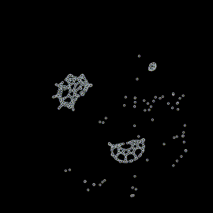
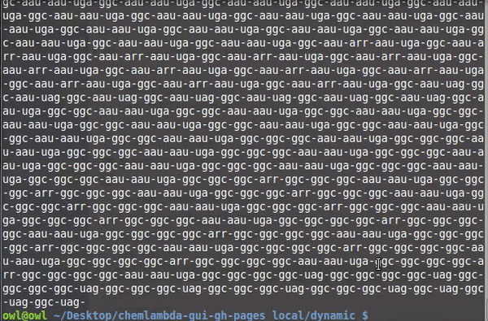
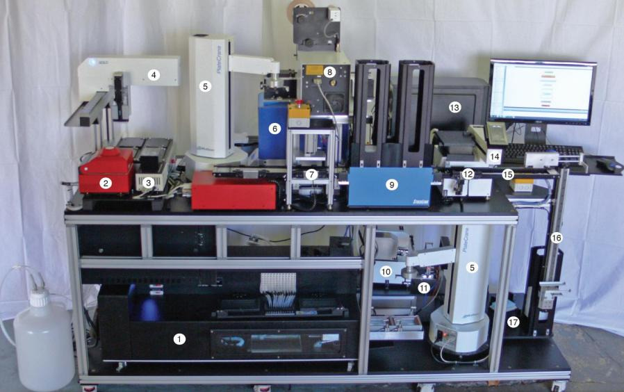

Molecular computers pitch talk 
===============================

\@xorasimilarity on telegram

**also available:** 
<https://telegra.ph/Molecular-computers-pitch-talk-05-14>

We can program a computer to do anything. What if we had the same power
over the molecules of our bodies?

**Define a molecular computer as one molecule which transforms, by
random chemical reactions mediated by a collection of enzymes, into a
predictable other molecule, such that the output molecule can be
conceived as the result of a computation encoded in the initial
molecule.**

Let's imagine how this could change our lives. For example\...

\-\--

Adam meets Eve at a party. She thinks he\'s attractive but, wait: her
sniffer ring can detect Adam\' biomolecules.

 Something is wrong with Adam, according to Eve\'s sniffer ring, which
triggers a health warning. Eve forwards the warning to Adam\'s phone and
the party goes on.

Back home, Adam checks with his internet/health insurance provider. He
files a bug report, with his biological ID and the RNA code of the
suspicious biomolecule detected by the sniffer ring.

Somewhere the RNA code from the bug report and the ID are converted to a
simulation written in a language which hackers love. 

The wizards debug the faulty molecular behaviour, find a solution and
they convert it back to RNA code.

The code is sent to Adam\'s router, which is a much smaller, distant
relative of a Venter printer. It can synthesize proteins from the RNA
code and then emit them in the air. While the first Venter printer
looked like that

Adam\'s router looks like a small, biologically elegant box which in
emit mode expands a happy puppy tail.

The router emits these biomolecules into Adam\'s bedroom. Once inside
Adam\'s body, these biomolecules will correct the faulty behaviour of
Adam\'s metabolism. Bug solved. Adam is in perfect health.

\-\--

In order to make this real we might try the following steps.

Steps 1 and 3 are done, in principle. Step 2 is problematic, probably
based on pattern search over databases of chemical reactions.

**1. Build a virtual chemistry which we can program.** Computers are
Turing Machines. There\'s a memory which contains the input, output
and programs. The processor reads the input and a program and writes the
output in the memory.

In this virtual chemistry the input, output and programs are all
molecules. There is no processor. Everything is done by those molecules
via their chemical reactions. The challenge is to be able to design
these molecules so that we can obtain the result we want even if we let
them free to interact.

The purpose of the [chemlambda
project](https://chemlambda.github.io/index.html) is to experiment with
the limits of this freedom.

**2. Simulate the virtual chemistry in Nature.** There\'s no computer as
powerful as the real world. Find for each element of the virtual
chemistry a similar biomolecule, for each kind of virtual chemical
reaction find a similar, real one.

In the scenario we want to correct Adam\'s metabolism. We could turn
this problem into a similar problem in the virtual chemistry. On the
virtual side, the problem would be like debugging a program.

**3. Build machines able to convert** from virtual chemistry back into
biomolecules.

\-\--

#### Notes:

-   Adam and Eve here are taken from [The Internet of
    Smells](/Internet-of-Smells-04-26)
-   The definition of a molecular computer is taken from [Molecular
    computers](http://chorasimilarity.github.io/chemlambda-gui/dynamic/molecular.html)
    (needs js enabled) with pdf version on
    [(figshare)](https://doi.org/10.6084/m9.figshare.7339103.v1) or
    [arXiv:1811.04960 \[cs.ET\]](https://arxiv.org/abs/1811.04960)
-   Probably the newest part of the proposal is to use molecular
    patterns which embody those from [Interaction Combinators or
    chemlambda](https://mbuliga.github.io/quinegraphs/ic-vs-chem.html#icvschem).
    It is a challenge in itself to program with those, because
    functional programming or lambda calculus are just an inspiration.
-   In order to learn how to program with graph rewrite systems, the
    chemlambda project has hundreds of simulations, [try
    this](https://chemlambda.github.io/collection.html#204) (needs js
    enabled).
-   This is the text which goes with the [Chemlambda for the people
    slides](https://chorasimilarity.github.io/chemlambda-gui/dynamic/cfp.html)
    (needs js enabled).

