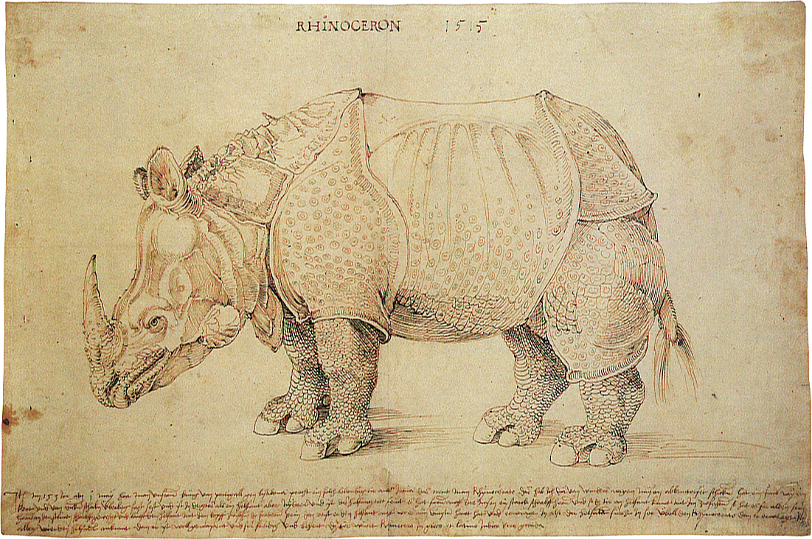

A Wittgenstein joke 
===================

**from:** 
<https://chorasimilarity.wordpress.com/2021/05/23/a-wittgenstein-joke/>

From this
[source](http://www.writing.upenn.edu/library/Wittgenstein-Tractatus.pdf).
I only added the "Framing", "Telling" and "Punchline" headlines, to make
the joke clearer. All the rest is (the standard English translation) of
Wittgenstein' text.

Framing:
--------

The whole sense of the book might be summed up in the following words:
what can be said at all can be said clearly, and what we cannot talk
about we must pass over in silence.

Thus the aim of the book is to draw a limit to thought \[...\]

It will therefore only be in language that the limit can be drawn, and
what lies on the otherside of the limit will simply be nonsense.

Telling:
--------

2.026 There must be objects, if the world is to have unalterable form.

------------------------------------------------------------------------

2.01 A state of affairs (a state of things) is a combination of objects
(things).

2.03 In a state of affairs objects fit into one another like the links
of a chain.

2.031 In a state of affairs objects stand in a determinate relation to
one another.

------------------------------------------------------------------------

2.011 It is essential to things that they should be possible
constituents of states of affairs.

2.013 Each thing is, as it were, in a space of possible states of
affairs. This space I can imagine empty, but I cannot imagine the thing
without the space.

------------------------------------------------------------------------

1 The world is all that is the case.

2 What is the case ---a fact--- is the existence of states of affairs.

2.04 The totality of existing states of affairs is the world.

1.1 The world is the totality of facts, not of things.

1.2 The world divides into facts.

------------------------------------------------------------------------

2.05 The totality of existing states of affairs also determines which
states of affairs do not exist.

2.06 The existence and non-existence of states of affairs is reality.

------------------------------------------------------------------------

2.1 We picture facts to ourselves.

2.141 A picture is a fact.

------------------------------------------------------------------------

2.12 A picture is a model of reality.

2.224 It is impossible to tell from the picture alone whether it is true
or false.

2.223 In order to tell whether a picture is true or false we must
compare it with reality.

2.21 A picture agrees with reality or fails to agree; it is correct or
incorrect, true or false.

Punchline:
----------

... the truth of the thoughts that are here communicated seems to me
unassailable and definitive. I therefore believe myself to have found,
on all essential points, the final solution of the problems.

The story of the rhino thing 
============================

**from:** 
<https://chorasimilarity.wordpress.com/2014/01/04/notes-for-internet-of-things-not-internet-of-objects/>

This is a story about how the rhinoceros thing birthed various rhinoceros objects. 

Quotes  and images from
[here:](https://en.wikipedia.org/wiki/D%C3%BCrer%27s_Rhinoceros#The_rhinoceros)

"On 20 May 1515, an Indian rhinoceros arrived in Lisbon from the Far
East.

After a relatively fast voyage of 120 days, the rhinoceros was finally
unloaded in Portugal, near the site where the Manueline [Belém
Tower](https://en.wikipedia.org/wiki/Bel%C3%A9m_Tower "Belém Tower") was
under construction. The tower was later decorated with gargoyles shaped as
rhinoceros heads under its corbels.

A rhinoceros had not been seen in Europe since Roman times: it had
become something of a mythical beast, occasionally conflated in 
bestiaries with the "monoceros" (unicorn), so the arrival of a living 
example created a sensation.

The animal was examined by scholars and the curious, and letters
describing the fantastic creature were sent to correspondents throughout
Europe. The earliest known image of the animal illustrates a *poemetto*
by Florentine [Giovanni Giacomo Penni](https://en.wikipedia.org/wiki/Giovanni_Giacomo_Penni "Giovanni Giacomo Penni"),
published in Rome on 13 July 1515, fewer than eight weeks after its arrival in Lisbon.

[Valentim
Fernandes](https://en.wikipedia.org/wiki/Valentim_Fernandes "Valentim Fernandes") 
 saw the rhinoceros in Lisbon shortly after it arrived and wrote a 
letter describing it to a friend in Nuremberg in June
1515.  A second letter of unknown authorship was sent from Lisbon to
Nuremberg at around the same time, enclosing a sketch by an unknown
artist. Dürer saw the second letter and sketch in Nuremberg. Without
ever seeing the rhinoceros himself, Dürer made two pen and ink 
drawings and then a woodcut was carved from the second drawing, the 
process making the print a reversed reflection of the
drawing. The German inscription on the woodcut, drawing largely from Pliny's
account, reads:
  --- ----------------------------------------------------------------------------------------------------------------------------------------------------------------------------------------------------------------------------------------------------------------------------------------------------------------------------------------------------------------------------------------------------------------------------------------------------------------------------------------------------------------------------------------------------------------------------------------------------------------------------------------------------------------------------------------------------------------------------------------------------------------------------------------------------------------------------------------------------------------------------------------------------------------------------------------------------------------------------------------------------------------------------------
  "   On the first of May in the year 1513 AD \[sic\], the powerful King of Portugal, Manuel of Lisbon, brought such a living animal from India, called the rhinoceros. This is an accurate representation. It is the colour of a speckled tortoise and is almost entirely covered with thick scales. It is the size of an elephant but has shorter legs and is almost invulnerable. It has a strong pointed horn on the tip of its nose, which it sharpens on stones. It is the mortal enemy of the elephant. The elephant is afraid of the rhinoceros, for, when they meet, the rhinoceros charges with its head between its front legs and rips open the elephant's stomach, against which the elephant is unable to defend itself. The rhinoceros is so well-armed that the elephant cannot harm it. It is said that the rhinoceros is fast, impetuous and cunning.
  --- ----------------------------------------------------------------------------------------------------------------------------------------------------------------------------------------------------------------------------------------------------------------------------------------------------------------------------------------------------------------------------------------------------------------------------------------------------------------------------------------------------------------------------------------------------------------------------------------------------------------------------------------------------------------------------------------------------------------------------------------------------------------------------------------------------------------------------------------------------------------------------------------------------------------------------------------------------------------------------------------------------------------------------------

Despite its errors, the image remained very
popular and was taken to be an accurate representation of a rhinoceros until the
late 18th century.

The pre-eminent position of Dürer's image and its derivatives declined
from the mid-to-late-18th century, when more live rhinoceroses were
transported to Europe, shown to the curious public, and depicted in more
accurate representations.

Until the late 1930s, Dürer's image appeared in school textbooks in
Germany [as a faithful image of the
rhinoceros](http://en.wikipedia.org/wiki/D%C3%BCrer%27s_Rhinoceros#cite_note-Clarke20-6). 
In German the Indian rhinoceros is still called the *Panzernashorn*, or
"armoured rhinoceros". It remains a powerful artistic influence, and was
the inspiration for [Salvador
Dalí](http://en.wikipedia.org/wiki/Salvador_Dal%C3%AD "Salvador Dalí")'s
1956 sculpture, *Rinoceronte vestido con puntillas* (Rhinoceros dressed
in lace), which has been displayed at [Puerto
Banús](http://en.wikipedia.org/wiki/Puerto_Ban%C3%BAs "Puerto Banús"),
in Marbella, since 2004."

The reality thing 
=================

Here is a depiction of a thing
\[[source](https://en.wikipedia.org/wiki/Thing_%28assembly%29)\]:

> *A **thing**  was the governing assembly  made up of the free people
> of the community, meeting in a place called a **thingstead**.*

("thing" in Germanic societies,  "res" for Romans, etc.)

 I believe that reality is a discussion (res), or a trial, which happens in places (chora or thingstead). Objects are evidence used in the discussion, or trial which is reality. Objects are reifications of those discussions which achieve consensus.  Therefore, in this belief, reality is not objective. Objects are evidence, used to argue that a new discussion is no longer necessary, in the larger discussion which happens in the thingstead.

Objects are degraded, dead versions of things, evidence for other things but otherwise no longer interacting with reality. Reality is the one of things, not of objects. 

This is a failed philosophical program: first to rely on objects because one abhors discussions, interactions, then to put back interactions by the backdoor, for objects. Since objects are by  their definition non-interacting, the reality is hidden by this smoke and mirrors which tries to bootstrap objects to things. During this effort of putting objects first, which was a very dangerous thing to do, the meaning of thing and object have been mixed or even reversed. 
 
Do you believe the Wittgenstein' joke on the primate of objects and states of affairs, which have intrinsic structure and properties like colour? that there is nothing more to talk about? Then everything is as neatly organized as a modern database, accesible via a search engine (telling you what is real) and a fact checker (telling you what is true).

